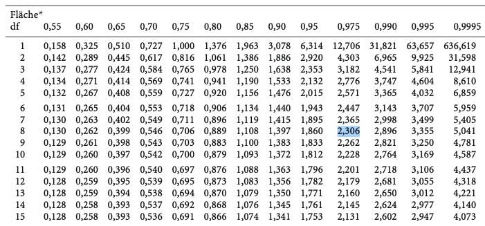
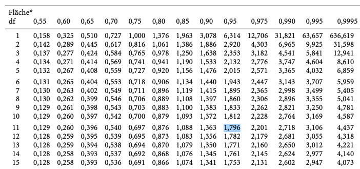
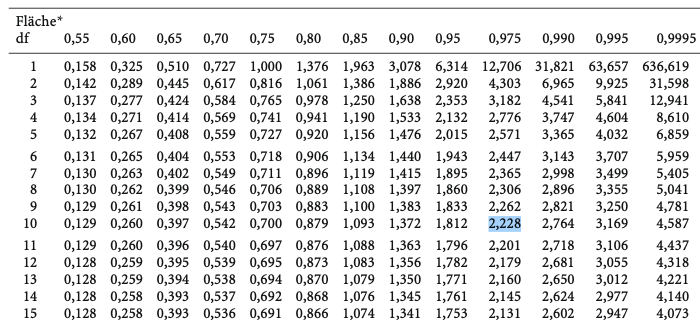

```{r setup, include=FALSE}
options(htmltools.dir.version = FALSE)

setwd("/Users/stephangoerigk/Desktop/Universität/CFH/Lehre/Bachelor/Quantitative Methoden I/VO_Statistik I/Statistik_I_Folien/")

library(tidyverse)
library(kableExtra)
library(ggplot2)
library(plotly)
library(htmlwidgets)
library(MASS)
library(ggpubr)
library(xaringanthemer)
library(xaringanExtra)
library(gghighlight)

style_duo_accent(
  primary_color = "#621C37",
  secondary_color = "#EE0071",
  background_image = "blank.png"
)

xaringanExtra::use_xaringan_extra(c("tile_view"))

use_scribble(
  pen_color = "#EE0071",
  pen_size = 4
)

knitr::opts_chunk$set(
  fig.retina = TRUE,
  warning = FALSE,
  message = FALSE
)
```

name: Title slide
class: middle, left
<br><br><br><br><br><br><br>
# Statistik I

### Einheit 11: Korrelation (2)
##### 05.07.2023 | Prof. Dr. phil. Stephan Goerigk

---
class: top, left
<small>
### Wiederholung: Korrelation händisch rechnen

**Anleitung - Schritt für Schritt:**


1. Hypothesenpaar aus $H_{0}$ und $H_{1}$ aufstellen
  * VORSICHT: gerichtet oder ungerichtet $\rightarrow$ Unterschied bei Signifikanzgrenze

2. Ggf. Mittelwerte und Streuungen berechnen (es sei denn bereits angegeben). 
  * VORSICHT: Es kann in der Aufgabenstellung Varianz ODER Standardabweichung gegeben sein
  * VORSICHT: Bei der Spearman Korrelation Differenzen zwischen Rängen berechnen
  
3. Korrelationskoeffizient berechnen
  * Pearson: Zunächtst Kovarianz und maximale Kovarianz $|cov_{max}|$ berechnen
  * Spearman: Kann direkt über Formel berechnet werden

4. Richtung (positiv/negativ) und Stärke (Cohen: schwach/klein, mittel, groß/stark) bestimmen

5. t-Wert $(t_{emp})$ unter der Nullhypothese bestimmen

6. kritischen t-Wert $(t_{krit})$ aus Tabelle ablesen
  * VORSICHT: gerichtet/einseitig $\rightarrow$ $1-\alpha =.95$; ungerichtet/zweiseitig $\rightarrow$ $\frac{1-\alpha}{2}=.975$

7. Vergleich von $t_{emp}$ mit $t_{krit}$. Wenn $t_{emp} > t_{krit}$ $\rightarrow$ Test signifikant $\rightarrow$ $H_{0}$ verwerfen

</small>


---
class: top, left
### Korrelation

#### Übungsaufgabe 1: Bystander Effekt

* Ein Psychologe möchte prüfen, ob die Anzahl der Menschen, die einen Überfall beobachten, mit der Zeit zusammenhängt, die vergeht, bis der überfallenen Person geholfen wird.

* Er engagiert 2 Schauspieler, die an 10 verschiedenen Orten in Berlin einen Überfall vorspielen und misst die Zeit (in Sekunden), bis geholfen wird.

Das sind die Ergebnisse:

```{r echo = F}
set.seed(123)
N = 10
df = data.frame(ID = c(paste0(rep(1:N))),
                Menschen = c(13,8,6,7,7,4,6,9,13,8)
)

df$Zeit = c(47,36,12,30,24,23,29,29,43,29)
df$Zeit = round(df$Zeit)
names(df) = c("ID", "Menschen (X)", "Zeit (Y)")
df2 = df
df = as.data.frame(t(df))
#rownames(df) = NULL
kable(df[,], col.names = NULL)%>%
  kable_styling(font_size = 18)
```

**Aufgaben:**

a) Stellen Sie das Hypothesenpaar aus $H_{0}$ und $H_{1}$ auf.

b) Prüfen Sie, ob es einen signifikanten statistischen Zusammenhang zwischen den Variablen gibt $(\alpha=.05)$. 

---
class: top, left
### Korrelation

#### Übungsaufgabe 1: Bystander Effekt

a) Stellen Sie $H_{0}$ und $H_{1}$ auf.

* $H_{0}$: $\rho =0$
* $H_{1}$: $\rho \neq 0$

**Interpretation:**

* $H_{0}$:
  * Die $H_{0}$ besagt, dass kein signifikanter Zusammenhang zwischen Gruppengröße und Zeit bis zur Hilfeleistung besteht.
  * Laut der $H_{0}$ variieren die beiden Variablen nicht systematisch miteinander
* $H_{1}$:
  * Die $H_{1}$ besagt, signifikanter Zusammenhang zwischen Gruppengröße und Zeit bis zur Hilfeleistung besteht.
  * Laut der $H_{1}$ gehen hohe/niedrige Gruppengrößen mit langen/kurzen Zeit bis zur Hilfeleistung einher.

---
class: top, left
### Korrelation

#### Übungsaufgabe 1: Bystander Effekt

b) Prüfen Sie, ob es einen signifikanten statistischen Zusammenhang zwischen den Variablen gibt $(\alpha=.05)$. 

Berechnen der Stichprobencharakteristika:

.pull-left[

$$\bar{x}=\frac{\sum\limits _{i=1}^{n}x_{i}}{n} =`r round(mean(df2[,2]),2)`$$ 
$$\bar{y}=\frac{\sum\limits _{i=1}^{n}y_{i}}{n} = `r round(mean(df2[,3]),2)`$$
]
.pull-right[
$$s_x=\sqrt{\frac{\sum\limits _{i=1}^{n}(x_{i}-\bar{x})^2}{n-1}}= `r round(sd(df2[,2]),2)`$$ 

$$s_y=\sqrt{\frac{\sum\limits _{i=1}^{n}(y_{i}-\bar{y})^2}{n-1}}= `r round(sd(df2[,3]),2)`$$ 
]

---
class: top, left
### Korrelation

#### Übungsaufgabe 1: Bystander Effekt

b) Prüfen Sie, ob es einen signifikanten statistischen Zusammenhang zwischen den Variablen gibt $(\alpha=.05)$. 

Berechnen der Kovarianz:

$$cov_{x,y}=\frac{(13-8.1)\cdot(47-30.2)+(8-8.1)\cdot(36-30.2)+...}{`r N-1`}=23.99$$
Berechnen der maximale Kovarianz:

$$|cov_{max}|=\hat{\sigma}_x \cdot \hat{\sigma}_y = `r round(sd(df2[,2]),2)` \cdot `r round(sd(df2[,3]),2)`= `r round(round(sd(df2[,3]),2) * round(sd(df2[,2]),2), 2)`$$
Berechnen der Produkt-Moment-Korrelation:

$$r_{xy}=\frac{cov_{emp}}{cov_{max}} = \frac{23.99}{`r round(round(sd(df2[,3]),2) * round(sd(df2[,2]),2), 2)`}=0.82$$

---
class: top, left
### Korrelation

#### Übungsaufgabe 1: Bystander Effekt

b) Prüfen Sie, ob es einen signifikanten statistischen Zusammenhang zwischen den Variablen gibt $(\alpha=.05)$. 

Berechnen von $t_{emp}$:

$$df=N-2=`r nrow(df2)`-2= `r nrow(df2)-2` $$

$$t=\frac{r \cdot \sqrt{N-2}}{\sqrt{1-r^2}}= \frac{0.82 \cdot \sqrt{10-2}}{\sqrt{1-(0.82)^2}}=4.05$$

---
class: top, left
### Korrelation

#### Übungsaufgabe 1: Bystander Effekt

Kritischen t-Wert $(t_{krit})$ für $a=.05$ nachschlagen:

.center[
```{r eval = TRUE, echo = F, out.width = "750px"}

```
]

---
class: top, left
### Korrelation

#### Übungsaufgabe 1: Bystander Effekt

b) Prüfen Sie, ob es einen signifikanten statistischen Zusammenhang zwischen den Variablen gibt $(\alpha=.05)$. 

Berechnen von $t_{emp}$:

$$df=N-2=`r nrow(df2)`-2= `r nrow(df2)-2` $$

$$t=\frac{r \cdot \sqrt{N-2}}{\sqrt{1-r^2}}= \frac{0.82 \cdot \sqrt{10-2}}{\sqrt{1-(0.82)^2}}=4.05$$


* $t_{krit(df=8)}=2.306$ $\rightarrow$ Spalte für 0.975 in der t-Tabelle, da ungerichtete Hypothese
* Der empirische t-Wert ist größer als der kritische t-Wert, es besteht ein signifikanter Zusammenhang.
* Die $H_{0}$ kann verworfen werden. Die Anzahl der Menschen, die einen Überfall beobachten hängt systematisch mit der Zeit bis zur Hilfeleistung zusammen.

---
class: top, left
### Korrelation

#### Übungsaufgabe 2: Klassische Musik

* In einer Studie soll geprüft werden, ob die Anzahl an Stunden, die Kinder pro Woche klassische Musik hören positiv mit deren Intelligenz zusasmmenhängt.

* Es wurde eine Gruppe von 13 Kindern über ihren klassischen Musikkonsum (in Stunden pro Woche) befragt, danach wurde ein Intelligenztest absolviert und der Intelligenzquotient (IQ) berechnet.

Das sind die Ergebnisse:

```{r echo = F}
set.seed(123)
N = 13
df = data.frame(ID = c(paste0(rep(1:N))),
                Musik = round(c(rnorm(N, 8, 2)))
)

df$IQ = faux::rnorm_pre(df$Musik, mu = 100, sd = 15, r = 0.1, empirical = T)
df$IQ = round(df$IQ)
names(df) = c("ID", "Musik (X)", "IQ (Y)")
df2 = df
df = as.data.frame(t(df))
#rownames(df) = NULL
kable(df[,], col.names = NULL)%>%
  kable_styling(font_size = 18)
```

**Aufgaben:**

a) Stellen Sie das Hypothesenpaar aus $H_{0}$ und $H_{1}$ auf.

b) Prüfen Sie, ob es einen signifikanten statistischen Zusammenhang zwischen den Variablen gibt $(\alpha=.05)$. 

---
class: top, left
### Korrelation

#### Übungsaufgabe 2: Klassische Musik

a) Stellen Sie $H_{0}$ und $H_{1}$ auf.

* $H_{0}$: $\rho \leq 0$
* $H_{1}$: $\rho > 0$

**Interpretation:**

* $H_{0}$:
  * Die $H_{0}$ besagt, dass kein Zusammenhang zwischen den Stunden, die ein Kind klassische Musik hört und dem IQ besteht, oder dieser negativ ist.
  * Laut der $H_{0}$ variieren die beiden Variablen nicht oder negativ systematisch miteinander
* $H_{1}$:
  * Die $H_{1}$ besagt, dass ein positiver Zusammenhang zwischen den Stunden, die ein Kind klassische Musik hört und dem IQ besteht.
  * Laut der $H_{1}$ geht ein hoher klassischer Musikkonsum mit einem hohen einher.

---
class: top, left
### Korrelation

#### Übungsaufgabe 2: Klassische Musik

b) Prüfen Sie, ob es einen signifikanten statistischen Zusammenhang zwischen den Variablen gibt $(\alpha=.05)$. 

Berechnen der Stichprobencharakteristika:

.pull-left[

$$\bar{x}=\frac{\sum\limits _{i=1}^{n}x_{i}}{n} =`r round(mean(df2[,2]),2)`$$ 
$$\bar{y}=\frac{\sum\limits _{i=1}^{n}y_{i}}{n} = `r round(mean(df2[,3]),2)`$$
]
.pull-right[
$$s_x=\sqrt{\frac{\sum\limits _{i=1}^{n}(x_{i}-\bar{x})^2}{n-1}}= `r round(sd(df2[,2]),2)`$$ 

$$s_y=\sqrt{\frac{\sum\limits _{i=1}^{n}(y_{i}-\bar{y})^2}{n-1}}= `r round(sd(df2[,3]),2)`$$ 
]

---
class: top, left
### Korrelation

#### Übungsaufgabe 2: Klassische Musik

b) Prüfen Sie, ob es einen signifikanten statistischen Zusammenhang zwischen den Variablen gibt $(\alpha=.05)$. 

Berechnen der Kovarianz:

$$cov_{x,y}=\frac{(7-8.38)\cdot(114-100)+(8-8.38)\cdot(99-100)+...}{`r N-1`}=`r round(cov(df2[,2], df2[,3]), 2)`$$
Berechnen der maximale Kovarianz:

$$|cov_{max}|=\hat{\sigma}_x \cdot \hat{\sigma}_y = `r round(sd(df2[,2]),2)` \cdot `r round(sd(df2[,3]),2)`= `r round(round(sd(df2[,3]),2) * round(sd(df2[,2]),2), 2)`$$
Berechnen der Produkt-Moment-Korrelation:

$$r_{xy}=\frac{cov_{emp}}{cov_{max}} = \frac{`r round(cov(df2[,2], df2[,3]), 2)`}{`r round(round(sd(df2[,3]),2) * round(sd(df2[,2]),2), 2)`}=0.11$$

---
class: top, left
### Korrelation

#### Übungsaufgabe 2: Klassische Musik

b) Prüfen Sie, ob es einen signifikanten statistischen Zusammenhang zwischen den Variablen gibt $(\alpha=.05)$. 

Berechnen von $t_{emp}$:

$$df=N-2=`r nrow(df2)`-2= `r nrow(df2)-2` $$

$$t=\frac{r \cdot \sqrt{N-2}}{\sqrt{1-r^2}}= \frac{0.11 \cdot \sqrt{13-2}}{\sqrt{1-(0.11)^2}}=0.37$$

---
class: top, left
### Korrelation

#### Übungsaufgabe 2: Klassische Musik

Kritischen t-Wert $(t_{krit})$ für $a=.05$ nachschlagen:

.center[
```{r eval = TRUE, echo = F, out.width = "750px"}

```
]

---
class: top, left
### Korrelation

#### Übungsaufgabe 2: Klassische Musik

b) Prüfen Sie, ob es einen signifikanten statistischen Zusammenhang zwischen den Variablen gibt $(\alpha=.05)$. 

Berechnen von $t_{emp}$:

$$df=N-2=`r nrow(df2)`-2= `r nrow(df2)-2` $$

$$t=\frac{r \cdot \sqrt{N-2}}{\sqrt{1-r^2}}= \frac{0.11 \cdot \sqrt{13-2}}{\sqrt{1-(0.11)^2}}=0.37$$


* $t_{krit(df=11)}=1.796$ $\rightarrow$ Spalte für 0.95 in der t-Tabelle, da gerichtete Hypothese
* Der empirische t-Wert ist kleiner als der kritische t-Wert, es besteht kein signifikanter Zusammenhang.
* Die $H_{0}$ wird beibehalten. Die Anzahl an Stunden, die Kinder pro Woche klassische Musik hören, hängt nicht systematisch mit ihrem IQ zusammen.


---
class: top, left
### Korrelation

#### Übungsaufgabe 3: Springen und Werfen

.pull-left[
<small>
* Für die Auswertung der diesjährigen Bundesjugendspiele soll geprüft werden, ob die Leistung im Speerwurf mit der im Weitsprung zusammenhängt.

* Es wurde eine Stichprobe von 12 Schüler:innen der 11. Klasse in beiden Disziplinen geprüft. Die Platzierung im Wettkampf wurde jeweils in einer Tabelle eingetragen:

**Aufgaben:**

a) Stellen Sie das Hypothesenpaar aus $H_{0}$ und $H_{1}$ auf.

b) Prüfen Sie, ob es einen signifikanten statistischen Zusammenhang zwischen den Variablen gibt $(\alpha=.05)$. 

</small>
]

.pull-right[
```{r echo = F}
set.seed(123)
N = 12
df = data.frame(ID = c(paste0(rep(1:N))),
                Schlaf = c(3,7,8,4,12,2,6,5,11,10,1,9)
)

df$Konzentration = c(1,4,8,5,10,2,9,6,11,12,3,7)
df$Konzentration = round(df$Konzentration)
names(df) = c("Schüler:in", "Rangplatz Frauen", "Rangplatz Männer")
df$`Rangplatz Männer`[df$`Rangplatz Männer` > 10] = 10
df$`Rangplatz Männer`[df$`Rangplatz Männer` < 1] = 1
df$`Rangplatz Frauen`[df$`Rangplatz Frauen` > 10] = 10
df$`Rangplatz Frauen`[df$`Rangplatz Frauen` < 1] = 1

df[, "Differenz (d)"] = df$`Rangplatz Frauen` - df$`Rangplatz Männer` 
names(df) = c("Schüler:in", "Rang Speerwurf (X)", "Rang Weitsprung (Y)", "Differenz (d)")

df2 = df
df = as.data.frame(df)
#rownames(df) = NULL
kable(df[,])%>%
  kable_styling(font_size = 16)
```
]

---
class: top, left
### Korrelation

#### Übungsaufgabe 3: Springen und Werfen

$$r_s={}1-\frac{6 \cdot\displaystyle \sum_{i=1}^{n}d^2_i}{N \cdot (N^2 - 1)}=1-\frac{192}{1716}=0.89$$
Berechnen von $t_{emp}$:

$$df=N-2=`r nrow(df2)`-2= `r nrow(df2)-2` $$

$$t=\frac{r \cdot \sqrt{N-2}}{\sqrt{1-r^2}}= \frac{0.89 \cdot \sqrt{12-2}}{\sqrt{1-(0.89)^2}}=6.12$$

---
class: top, left
### Korrelation

#### Übungsaufgabe 3: Springen und Werfen

Kritischen t-Wert $(t_{krit})$ für $a=.05$ nachschlagen:

.center[
```{r eval = TRUE, echo = F, out.width = "750px"}

```
]

---
class: top, left
### Korrelation

#### Übungsaufgabe 3: Springen und Werfen

$$r_s={}1-\frac{6 \cdot\displaystyle \sum_{i=1}^{n}d^2_i}{N \cdot (N^2 - 1)}=1-\frac{192}{1716}=0.89$$
Berechnen von $t_{emp}$:

$$df=N-2=`r nrow(df2)`-2= `r nrow(df2)-2` $$

$$t=\frac{r \cdot \sqrt{N-2}}{\sqrt{1-r^2}}= \frac{0.89 \cdot \sqrt{12-2}}{\sqrt{1-(0.89)^2}}=6.12$$

* $t_{krit(df=10)}=2.228$ $\rightarrow$ Spalte für 0.975 in der t-Tabelle, da ungerichtete Hypothese
* Der empirische t-Wert ist größer als der kritische t-Wert, es besteht ein signifikanter Zusammenhang.
* Die $H_{0}$ wird verworfen. Der Rang den Schüler im Speerwerfen erreichen korreliert signifikant mit dem Rang, den sie im Weitsprung erreichen.


---
class: top, left
### Korrelation

#### Übungsaufgabe 3: Springen und Werfen

$$r_s={}1-\frac{6 \cdot\displaystyle \sum_{i=1}^{n}d^2_i}{N \cdot (N^2 - 1)}=1-\frac{192}{1716}=0.89$$
Berechnen von $t_{emp}$:

$$df=N-2=`r nrow(df2)`-2= `r nrow(df2)-2` $$

$$t=\frac{r \cdot \sqrt{N-2}}{\sqrt{1-r^2}}= \frac{0.89 \cdot \sqrt{12-2}}{\sqrt{1-(0.89)^2}}=6.12$$


---
class: top, left
### Take-aways

.full-width[.content-box-gray[
* Ein (bivariater) Zusammenhang zeigt sich darin, dass zwei Variablen **systematisch miteinander variieren**.

* Die **Kovarianz**, ein unstandardisiertes Zusammenhangsmaß, kann uns die Richtung des Zusammenhangs anzeigen, aber nicht direkt hinsichtlich seiner Stärke interpretiert werden.

* Der **Korrelationskoeffizient** $(r)$ ist ein standardisiertes Maß für den Zusammenhang zweier Variablen und kann Werte im Bereich von -1 bis +1 annehmen.

* Zusammenhänge zwischen zwei intervallskalierten Variablen werden mit der **Produkt-Moment-Korrelation** (Pearson), ordinalskalierte mit der **Rangkorrelation** (Spearman) berechnet.

* Die **Einteilung nach Cohen** erlaubt für $|r\geq.1|$, $|r\geq.3|$, $|r\geq.5|$ eine Unterteilung in kleine, mittlere und starke/große Zusammenhänge.

* Ein bestehender Zusammenhang gibt **keine Auskunft über Kausalbeziehungen** zwischen den untersuchten Variablen
]
]


