```{r setup, include=FALSE}
options(htmltools.dir.version = FALSE)

setwd("/Users/stephangoerigk/Desktop/Universität/CFH/Lehre/Bachelor/Quantitative Methoden I/VO_Statistik I/Statistik_I_Folien/")

library(tidyverse)
library(kableExtra)
library(ggplot2)
library(plotly)
library(htmlwidgets)
library(MASS)
library(ggpubr)
library(xaringanthemer)
library(xaringanExtra)

style_duo_accent(
  primary_color = "#621C37",
  secondary_color = "#EE0071",
  background_image = "blank.png"
)

xaringanExtra::use_xaringan_extra(c("tile_view"))

use_scribble(
  pen_color = "#EE0071",
  pen_size = 4
)

knitr::opts_chunk$set(
  fig.retina = TRUE,
  warning = FALSE,
  message = FALSE
)
```

name: Title slide
class: middle, left
<br><br><br><br><br><br><br>
# Statistik I

### Einheit 5: Wahrscheinlichkeitstheorie und Verteilungen
##### 10.05.2023 | Prof. Dr. phil. Stephan Goerigk

---
class: top, left
### Wahrscheinlichkeitstheorie und Verteilungen 

#### Wiederholung:

**Inferenzstatistik: **

Umfasst alle statistischen Verfahren, die es erlauben, trotz der Informationsunvollständigkeit der Stichprobendaten Aussagen über eine Population zu treffen.

**Population: **

* Gesamtheit aller Merkmalsträger:innen, auf die eine Untersuchungsfrage gerichtet ist.

**Stichprobe: **

* Auswahl bestimmter Merkmalsträger:innen aus einer Population

---
class: top, left
### Wahrscheinlichkeitstheorie und Verteilungen 

#### Wiederholung:

**Problem:**

* Wenn nur ein Teil der Grundgesamtheit erfasst wird, z.B. 100 Personen, ist die **Informationslage** in Bezug auf die Untersuchungsfrage **unvollständig**. Wir können nicht einfach deskriptiv-statistische Methoden verwenden.

* Wie kann man trotzdem Aussagen treffen, die sich auf alle Personen der Grundgesamtheit beziehen, obwohl nur die Daten einer Stichprobe vorliegen?

**Idee:**

* Wir ziehen die Personen zufällig aus der Population in die Stichprobe.

* Wir greifen auf mathematische Methoden zur Formalisierung von Zufallsprozessen zurück $\rightarrow$ Wahrscheinlichkeitstheorie

* Aus diesen ergeben sich Methoden, die Rückschlüsse von der Stichprobe auf die Population erlauben $\rightarrow$ Inferenzstatistik

---
class: top, left
### Wahrscheinlichkeitstheorie und Verteilungen 

#### Logik des Schließens von Stichprobe auf Population (Einzelschritte folgen)

.center[
```{r eval = TRUE, echo = F, out.width = "450px"}
knitr::include_graphics("bilder/Population.png")
```
]

---
class: top, left
### Wahrscheinlichkeitstheorie und Verteilungen

#### Wahrscheinlichkeitsrechnung als Grundlage der Inferenzstatistik

**Inferenzstatistik:**

* Schluss von Zufallsstichprobe auf Population

* Grundlage: Wahrscheinlichkeitsrechnung

* Zentral: Zufallsprozesse (Ausgang unsicher, nicht mit Sicherheit vorhersagbar)

**Wahrscheinlichkeitsrechnung:**

.center[*Mathematik ist der Versuch, alles zu bändigen, auch den Zufall.*

Rudolf Taschner]

* Statistischer Wahrscheinlichkeitsbegriff geht zurück auf 17. Jahrhundert (Frankreich)

* Im Jahr 1654 wandte sich der Glücksspieler Chevalier de Mere mit mehreren Fragen an den französischen Mathematiker Blaise Pascal

---
class: top, left
### Wahrscheinlichkeitstheorie und Verteilungen

#### Wahrscheinlichkeitsrechnung als Grundlage der Inferenzstatistik

**Stochastik:**

* Stochastik = die Kunst des Vermutens (altgriechisch)

* Mathematik setzt Vorstellung von Zufall voraus (= Modelle von Situationen, deren Ausgang unsicher ist)

* Keine Einzelereignisse vorhersagbar, aber:

* Erkennen von Regelmäßigkeiten bei Vorgängen, deren Ergebnisse vom Zufall abhängen.

* Zentraler Begriff: Zufallsexperiment

---
class: top, left
### Wahrscheinlichkeitstheorie und Verteilungen

#### Wahrscheinlichkeitsrechnung als Grundlage der Inferenzstatistik

**Zufallsexperiment:**

Im Prinzip beliebig oft wiederholbarer Vorgang, der nach bestimmter Vorschrift ausgeführt wird, wobei das Ergebnis vom Zufall abhängt, d.h. der Ausgang kann nicht eindeutig im voraus bestimmt werden.

* Folge von gleichartigen, voneinander unabhängigen Versuchen möglich.

* Entweder Folge voneinander unabhängiger Versuche mit einem Objekt oder jeweils einmaliger Versuche mit ”gleichartigen” (unabhängigen) Objekten.

Beispiele:

1. Ein Würfel wird wiederholte Male geworfen und es wird beobachtet, wie oft jede Zahl kommt.

2. Parteipräferenz bei weiblichen Jugendlichen zwischen 16 und 18 Jahren.

---
class: top, left
### Wahrscheinlichkeitstheorie und Verteilungen

#### Wahrscheinlichkeitsrechnung als Grundlage der Inferenzstatistik

**Zufallsexperiment - Nomenklatur:**

* Die möglichen Ergebnisse eines Zufallsexperimentes heißen Elementarereignisse ω

* Die Menge aller möglichen Ergebnisse eines Zufallsexperimentes bezeichnet man als Ereignisraum Ω.

* Beispiel: ’Einmaliges Würfeln’: Elementarereignisse sind {1}, {2}, {3}, {4}, {5}, {6}. Ereignisraum $Ω = {1, 2, 3, 4, 5, 6}$.

* Ereignis A: Teilmenge des Ereignisraums, z.B. alle geraden Augenzahlen beim Würfeln. Es gilt: $ω ∈ A, A ⊂ Ω$

* Sicheres Ereignis: Jenes Ereignis, welches unter gegebenen Bedingungen immer eintritt.

* Unmögliches Ereignis: Jenes Ereignis, welches unter gegebenen Bedingungen nie eintritt.

---
class: top, left
### Wahrscheinlichkeitstheorie und Verteilungen

#### Wahrscheinlichkeitsrechnung als Grundlage der Inferenzstatistik

**Definition der statistischen Wahrscheinlichkeit:**

Die Wahrscheinlichkeit für das Auftreten eines Ereignisses A, $P_{(A)}$, ist jener Wert, bei dem sich die relative Häufigkeit $r_{n}(A)$ bei
n $\rightarrow$ ∞ Versuchen unter gleichen Bedingungen stabilisiert.

Die mathematische Formulierung:

.center[
```{r eval = TRUE, echo = F, out.width = "250px"}
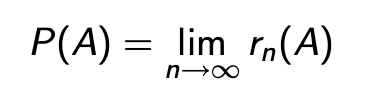
```
]

In anderen Worten:

* Die Wahrscheinlichkeit eines Ereignisses gibt an, mit welcher relativen Häufigkeit das Ereignis einträte, wenn man den Versuch theoretisch unendlich oft wiederholen würde.

* Sie sagt jedoch nichts darüber aus, wie häufig das Ereignis bei einer kleinen Anzahl von Versuchen, z.B. $n = 5$, auftritt.

---
class: top, left
### Wahrscheinlichkeitstheorie und Verteilungen

#### Wahrscheinlichkeitsrechnung als Grundlage der Inferenzstatistik

**Laplace-Wahrscheinlichkeit**


Bei Zufallsexperimenten, bei denen nur endlich viele, gleichwahrscheinliche Ergebnisse möglich sind, ergibt sich für ein beliebiges Ereignis A die Wahrscheinlichkeit

.center[
```{r eval = TRUE, echo = F, out.width = "750px"}
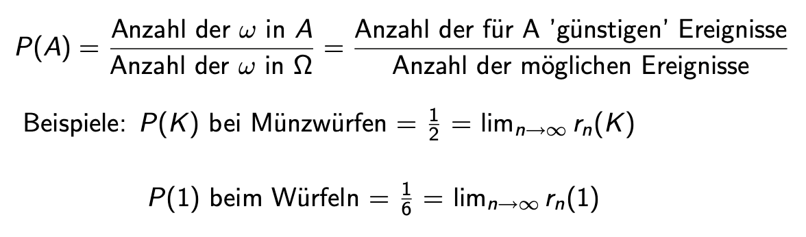
```
]

---
class: top, left
### Wahrscheinlichkeitstheorie und Verteilungen

#### Wahrscheinlichkeitsrechnung als Grundlage der Inferenzstatistik

**Axiome der Wahrscheinlichkeitsrechnung nach Kolmogoroff**

Wahrscheinlichkeiten lassen sich durch drei Eigenschaften, die auch f̈ür relative Häufigkeiten gelten, und aus denen sich alle Rechenregeln für Wahrscheinlichkeiten ableiten lassen, charakterisieren:


1. Für die Wahrscheinlichkeit eines Ereignisses gilt stets: $0 ≤ P(A) ≤ 1$.

2. Die Wahrscheinlichkeit eines sicheren Ereignisses beträgt $P(Ω) = 1$.

3. Additionsregel der Wahrscheinlichkeit: Die Wahrscheinlichkeit, dass eines von $k$ einander ausschließenden Ereignissen auftritt, ist die Summe der einzelnen Wahrscheinlichkeiten $P(A_{1}), P(A_{2}), . . . , P(A_{k})$.

$$P(A_{1} ∨ A_{2} ∨...∨ A_{k})=P(A_{1})+P(A_{2})+...+P(A_{k})$$
---
class: top, left
### Wahrscheinlichkeitstheorie und Verteilungen

#### Wahrscheinlichkeitsrechnung als Grundlage der Inferenzstatistik

**Rechenregeln: Unmögliches Ereignis**

* Die Wahrscheinlichkeit des unmöglichen Ereignisses B beträgt $P(B) = 0$.
 
* Wenn B ein unmögliches Ereignis ist, kann es nie eintreten: $rn(B) = 0 → P(B) = 0$.

Achtung: 

* Aus $P(B) = 0$ folgt aber nicht, dass B ein unmögliches Ereignis ist. 

* Das bedeutet nur, dass der Grenzwert der relativen Häufigkeit bei $n → ∞$ Null ist, woraus aber nicht folgt, dass B nie eintreten kann! (Analoges gilt für $P(A) = 1$).

---
class: top, left
### Wahrscheinlichkeitstheorie und Verteilungen

#### Wahrscheinlichkeitsrechnung als Grundlage der Inferenzstatistik

**Rechenregeln: Komplementärereignis**

* $P(A)+P(\bar{A})=1,P(\bar{A})=1−P(A)$

* $\bar{A}$ tritt immer dann ein, wenn $A$ nicht eintritt → $r_{n}(A) + r_{n}(\bar{A}) = 1$

Beispiel: Münzwurf: $P(K) + P(Z) = 0.5 + 0.5 = 1$

---
class: top, left
### Wahrscheinlichkeitstheorie und Verteilungen

#### Wahrscheinlichkeitsrechnung als Grundlage der Inferenzstatistik

**Bedingte Wahrscheinlichkeit**

* Bedingte Wahrscheinlichkeit P(A|B) (wörtlich: A unter der Bedingung B)

* Die Wahrscheinlichkeit von Ereignis A unter der Bedingung, dass Ereignis B bereits eingetreten ist. 

* D.h. das Eintreten von B beeinflusst die Wahrscheinlichkeit von A.

---
class: top, left
### Wahrscheinlichkeitstheorie und Verteilungen

#### Wahrscheinlichkeitsrechnung als Grundlage der Inferenzstatistik

**Beispiel: Bedingte Wahrscheinlichkeit**

* 100 Patient:innen, die vor einiger Zeit auf einer Warteliste für eine Psychotherapie standen, werden nach ihrem subjektiven Gesundheitszustand befragt.

* Einige dieser Patient:innen haben zwischenzeitlich einen Therapieplatz bekommen, andere noch nicht.

Bivariate Häufigkeitstabelle: Häufigkeiten von bereits in Behandlung befindlichen und noch wartenden KlientInnen bezüglich subjektiv gesund und nicht gesund.

.center[
```{r eval = TRUE, echo = F, out.width = "550px"}
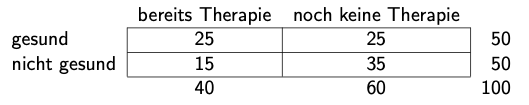
```
]

Frage: Wie hoch ist die Wahrscheinlichkeit P(G|T), dass eine Patient:in, die Therapie erhält, gesund ist?

---
class: top, left
### Wahrscheinlichkeitstheorie und Verteilungen

#### Wahrscheinlichkeitsrechnung als Grundlage der Inferenzstatistik

**Beispiel: Bedingte Wahrscheinlichkeit**

.center[
```{r eval = TRUE, echo = F, out.width = "550px"}
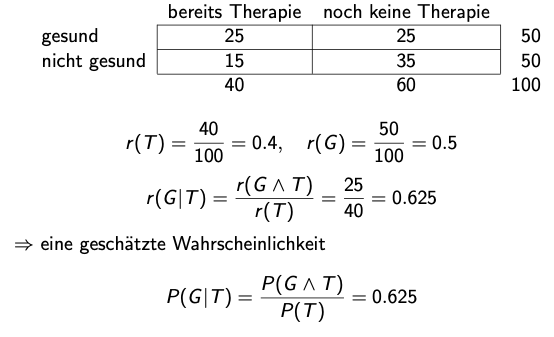
```
]

---
class: top, left
### Wahrscheinlichkeitstheorie und Verteilungen

#### Wahrscheinlichkeitsrechnung als Grundlage der Inferenzstatistik

**Multiplikationssatz der Wahrscheinlichkeit**

* Durch Umformen der bedingten Wahrscheinlichkeit ergibt sich $P(G ∧ T) = P(G|T)P(T)$

* Aus den bedingten Wahrscheinlichkeiten kann man die Wahrscheinlichkeit des Durchschnittsereignisses ausrechnen.

Beispiel:

* Mit einer Wahrscheinlichkeit von 1% rollt einem Autofahrer in einer Wohngegend ein Ball vor das Auto. 
* Die Wahrscheinlichkeit dafür, dass unmittelbar hinter dem Ball ein Kind nachgelaufen kommt, beträgt p = 0.99. 
* Wie groß ist die Wahrscheinlichkeit, dass ein Ball auf die Straße rollt und ein Kind hinterherläuft?

$$P(B ∧ K) = P(K|B)P(B) = 0.99 · 0.01 = 0.0099$$
---
class: top, left
### Wahrscheinlichkeitstheorie und Verteilungen

#### Wahrscheinlichkeitsrechnung als Grundlage der Inferenzstatistik

**Stochastische Unabhängigkeit von Ereignissen**

Zwei Ereignisse sind stochastisch unabhängig, wenn das Eintreten des einen Ereignisses keinen Einfluss auf das Eintreten des anderen Ereignisses hat.

$$P(A|B) = P(A)$$ und $$P(B|A) = P(B)$$

Zwei Ereignisse sind voneinander unabhängig, wenn die Wahrscheinlichkeit für das gemeinsame Auftreten dem Produkt ihrer Einzelwahrscheinlichkeiten entspricht (Multiplikationssatz für unabhängige Ereignisse)

$$P(A|B)= \frac{P(A∧B)}{P(B)} = P(A)⇒P(A∧B)=P(A)P(B)$$
---
class: top, left
### Wahrscheinlichkeitstheorie und Verteilungen

#### Wahrscheinlichkeitsrechnung als Grundlage der Inferenzstatistik

**Stochastische Unabhängigkeit von Ereignissen**

* Beim Ziehen mit Zurücklegen sind die einzelnen Wahrscheinlichkeiten gleich und die Ziehungen stochastisch unabhängig.

* Beim Ziehen ohne Zurücklegen ändern sich mit jeder Ziehung die Anteile der ’günstigen’ ωi , und daher auch die Wahrscheinlichkeiten. Die Ziehungen sind daher stochastisch abhängig.

---
class: top, left
### Wahrscheinlichkeitstheorie und Verteilungen

#### Wahrscheinlichkeitsrechnung als Grundlage der Inferenzstatistik

**Zufallsexperiment**

* Jedes mögliche Ergebnis aus einem Zufallsexperiment nennen wir ein Elementarereignis ω

* Die Menge aller möglichen Ereignisse ist definiert als der Ereignisraum Ω

* Der Ereignisraum Ω heißt diskret, wenn er aus abzählbar vielen Elementarereignissen besteht

* Der Ereignisraum Ω heißt stetig, wenn er aus überabzählbar vielen Elementarereignissen besteht

* Zufallsexperiment ist ein allgemeiner Begriff, der Grundlage für die Inferenzstatistik ist

---
class: top, left
### Wahrscheinlichkeitstheorie und Verteilungen

#### Wahrscheinlichkeitsrechnung als Grundlage der Inferenzstatistik

**Zufallsexperiment**

* Zufallsexperiment 1: 

  Einmaliger Wurf mit einer Münze; Ω = { Kopf, Zahl } endlich und abzählbar

* Zufallsexperiment 2: 

   Wurf mit einem Würfel so lange bis zum ersten Mal drei ’Einser’ hintereinander kommen; wir interessieren uns für die Anzahl der notwendigen Würfe; Ω = 3,4,5,··· oder Ω = {k : k natürliche Zahl ≥ 3}; Ω ist diskret und abzählbar unendlich

* Zufallsexperiment 3: 

  Lebensdauer einer Glühbirne; Ω = {x : x ≥ 0}; Ω ist stetig und überabzählbar unendlich

* Richtige Bestimmung von Ω ist Voraussetzung für Richtigkeit jeder weiteren statistischen Analyse

---
class: top, left
### Wahrscheinlichkeitstheorie und Verteilungen

#### Wahrscheinlichkeitsrechnung als Grundlage der Inferenzstatistik

**Zufallsvariable**

* Es seien ein Wahrscheinlichkeitsraum Ω und p(ω) für alle ω gegeben

* Eine mathematische Funktion X, welche jedem Ereignis ω eine reelle Zahl X(ω) zuweist, heißt Zufallsvariable (ZV)

* X ist eine Zufallsvariable (ZV), wenn die Werte von X reelle Zahlen sind, die durch ein Zufallsexperiment bestimmt werden, und wenn für die Ereignisse, die man damit beschreiben kann, Wahrscheinlichkeiten angebbar sind

* Der Wert, den die ZV bei der Durchführung des Zufallsexperimentes annimmt, heißt Realisation von X, und wird mit x bezeichnet

---
class: top, left
### Wahrscheinlichkeitstheorie und Verteilungen

#### Wahrscheinlichkeitsrechnung als Grundlage der Inferenzstatistik

**Zufallsvariable**

* Zufallsvariable lässt sich durch ihre Wahrscheinlichkeitsfunktion beschreiben, welche angibt, mit welcher Wahrscheinlichkeit die einzelnen Realisationen $x_{i}$ auftreten

* Es sei $p_{i}$ die Wahrscheinlichkeit des Auftretens des Wertes $x_{i}$; dann ist

$$f(x_{i})=P(X=x_{i})=p_{i}; p_{i} ∈[0,1]$$

* Wenn alle möglichen Ausprägungen von X berücksichtigt wurden,ist die Summe aller möglichen Einzelwahrscheinlichkeiten $p_{i}$ = 1

---
class: top, left
### Wahrscheinlichkeitstheorie und Verteilungen

#### Wahrscheinlichkeitsrechnung als Grundlage der Inferenzstatistik

**Dichtefunktion**

* Eine stetige ZV $X$ kann jeden Wert in einem Intervall [a, b] annehmen

* Die Wahrscheinlichkeiten der einzelnen Ausprägungen (Werte) einer stetigen ZV können (im Gegensatz zum diskreten Fall) nicht angegeben werden

* Es können nur Wahrscheinlichkeiten $f(x)dx$ angegeben werden, mit welchen die Werte innerhalb von Intervallen $dx$ um die Werte $x$ auftreten

* Beispielsweise fragt man nicht, wie viele Personen exakt 1.75 Meter groß sind, sondern z.B., wie viele Personen zwischen 1.75 und 1.76 Meter groß sind

* Die Funktion $f(x)$ heißt Dichtefunktion

---
class: top, left
### Wahrscheinlichkeitstheorie und Verteilungen

#### Wahrscheinlichkeitsrechnung als Grundlage der Inferenzstatistik

**Dichtefunktion**

* Die Wahrscheinlichkeit, dass die ZV Werte zwischen a und b annimmt, wird dann allgemein definiert als das Integral über die Dichtefunktion mit Integrationsgrenzen a und b.

* Analog zum diskreten Fall erhält man durch Integration die Verteilungsfunktion

* Die Wahrscheinlichkeit ist definiert als Fläche unter der Dichtefunktion

.center[
```{r eval = TRUE, echo = F, out.width = "350px"}
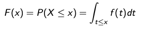
```
]

Es gilt für alle $a<b$:

.center[
```{r eval = TRUE, echo = F, out.width = "550px"}
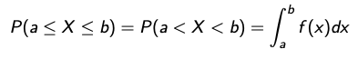
```
]

---
class: top, left
### Wahrscheinlichkeitstheorie und Verteilungen

#### Wahrscheinlichkeitsrechnung als Grundlage der Inferenzstatistik

**Erwartungswert**

Beispiel: X ist die erhaltene Augenzahl bei einmaligem Würfeln; die Wahrscheinlichkeitsverteilung von X ist:

.center[
```{r eval = TRUE, echo = F, out.width = "350px"}
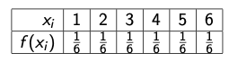
```
]
* Welchen Wert ’erwarten’ wir, wenn wir dieses Zufallsexperiment sehr lange durchführen?

* Intuitiv erwarten wir $X = 1$ bei $\frac{1}{6}$ der Würfe, $X = 2$ bei  $\frac{1}{6}$ bei der Würfe, usw.

* Der Durchschnitt von X auf lange Sicht ist der Erwartungswert von X

* Der Erwartungswert einer ZV ist ein Maß für das Zentrum der Verteilung

---
class: top, left
### Wahrscheinlichkeitstheorie und Verteilungen

#### Wahrscheinlichkeitsrechnung als Grundlage der Inferenzstatistik

**Varianz der ZV**

Die Varianz $σ^2$ ist ein Streuungsmaß der Verteilung

$$σ_{X}^2 =E[(X−E[X])^2]=E[X^2]−(E[X])^2$$

---
class: top, left
### Wahrscheinlichkeitstheorie und Verteilungen

#### Wahrscheinlichkeitsrechnung als Grundlage der Inferenzstatistik

**Varianz der ZV**

Beispiel: X ist die beobachtete Augenzahl bei einmaligem Würfeln; die Wahrscheinlichkeitsverteilung von X ist

.center[
```{r eval = TRUE, echo = F, out.width = "650px"}
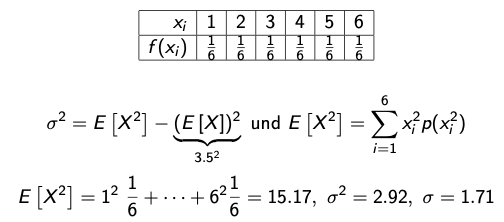
```
]

---
class: top, left
### Wahrscheinlichkeitstheorie und Verteilungen

#### Wahrscheinlichkeitsrechnung als Grundlage der Inferenzstatistik

**α-Quantil**

Als α-Quantil $q_{α}$ wird ein Wert bezeichnet, unterhalb dessen ein vorgegebener Anteil $α$ aller Fälle der Verteilung liegen

* Jeder Wert unterhalb von $q_{α}$ unterschreitet den Anteil $α$, mit $α$ als reelle Zahl zwischen 0 (gar kein Fall der Verteilung) und 1 (alle Fälle oder 100% der Verteilung)

* Für stetige ZV gilt:

.center[
```{r eval = TRUE, echo = F, out.width = "450px"}
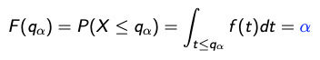
```
]

* Für diskrete ZV gilt (Aufrunden zur nächsten ganzzahligen Ausprägung):

.center[
```{r eval = TRUE, echo = F, out.width = "450px"}
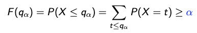
```
]

---
class: top, left
### Wahrscheinlichkeitstheorie und Verteilungen

#### Wahrscheinlichkeitsrechnung als Grundlage der Inferenzstatistik

##### Spezielle diskrete Verteilungen

**Diskrete Gleichverteilung**

* Diese Verteilung beschreibt eine ZV, welche die Zahlen $1,2,··· ,m$ annehmen kann, und es gilt:

.center[
```{r eval = TRUE, echo = F, out.width = "450px"}
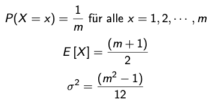
```
]

* Anwendung bei Zufallsexperimenten, deren Ergebnisse gleich häufig sind, also wenn angenommen wird, dass die $m$ Elementarereignisse gleichwahrscheinlich sind

---
class: top, left
### Wahrscheinlichkeitstheorie und Verteilungen

#### Wahrscheinlichkeitsrechnung als Grundlage der Inferenzstatistik

##### Spezielle diskrete Verteilungen

**Diskrete Gleichverteilung**

.center[
```{r eval = TRUE, echo = F, out.width = "650px"}
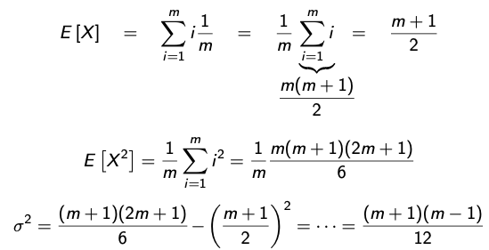
```
]

---
class: top, left
### Wahrscheinlichkeitstheorie und Verteilungen

#### Wahrscheinlichkeitsrechnung als Grundlage der Inferenzstatistik

##### Spezielle diskrete Verteilungen

**Diskrete Gleichverteilung**

* Beispiel: X = die erhaltene Augenzahl bei einmaligem Würfeln

.center[
```{r eval = TRUE, echo = F, out.width = "250px"}
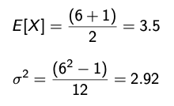
```
]

---
class: top, left
### Wahrscheinlichkeitstheorie und Verteilungen

#### Wahrscheinlichkeitsrechnung als Grundlage der Inferenzstatistik

##### Spezielle diskrete Verteilungen

**Diskrete Gleichverteilung**

.center[
```{r echo = F, out.width="350px", out.height="350px"}
require(ggplot2)
require(grid)

x1  <- 3:17
df <- data.frame(x = x1, y = rdunif(x1, 1, 1))

plot1 <- ggplot(df, aes(x = x, y = y)) + geom_bar(stat = "identity", col = "black", fill = "black") + 
  scale_y_continuous(expand = c(0.01, 0)) +
  coord_cartesian(ylim = c(0,2)) +
  xlab("1 bis m") + ylab("1/m") + 
  labs(title = "Gleichverteilung") + 
  theme_classic() +
  theme(plot.title = element_text(size = rel(1.2), vjust = 1.5), text = element_text(size = 25), axis.text.y = element_blank())

print(plot1)
```
]

---
class: top, left
### Wahrscheinlichkeitstheorie und Verteilungen

#### Wahrscheinlichkeitsrechnung als Grundlage der Inferenzstatistik

##### Spezielle diskrete Verteilungen

**Binomialverteilung**

* Wir betrachten ein Zufallsexperiment mit 2 Ausgängen, ’Erfolg (2)’ und ’Misserfolg (1)’

* Die Wahrscheinlichkeit für Erfolg sei $p$, mit $p$ zwischen 0 und 1

* Wir führen dieses Experiment n-mal durch, wobei zwischen den einzelnen Durchführungen Unabhängigkeit angenommen wird (’Ziehen mit Zurücklegen’)

* Die ZV X beschreibt die Anzahl der Erfolge und ist binomialverteilt mit Parametern n und p, X ~ $B(n, p)$

.center[
```{r eval = TRUE, echo = F, out.width = "550px"}
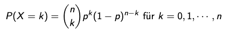
```
]

---
class: top, left
### Wahrscheinlichkeitstheorie und Verteilungen

#### Wahrscheinlichkeitsrechnung als Grundlage der Inferenzstatistik

##### Spezielle diskrete Verteilungen

**Binomialverteilung**

.center[
```{r echo = F, out.width="350px", out.height="350px"}
require(ggplot2)
require(grid)

x1  <- 3:17
df <- data.frame(x = x1, y = dbinom(x1, 20, 0.5))

plot1 <- ggplot(df, aes(x = x, y = y)) + geom_bar(stat = "identity", col = "black", fill = "black") + 
  scale_y_continuous(expand = c(0.01, 0)) + xlab("x") + ylab("Dichte") + 
  labs(title = "P(X=2) = 0.5, n = 20") + 
  theme_classic() +
  theme(plot.title = element_text(size = rel(1.2), vjust = 1.5), text = element_text(size = 25))

print(plot1)
```
]

---
class: top, left
### Wahrscheinlichkeitstheorie und Verteilungen

#### Wahrscheinlichkeitsrechnung als Grundlage der Inferenzstatistik

##### Spezielle diskrete Verteilungen

**Binomialverteilung**

* Beispiel: Ein Glücksrad besteht aus 20 Feldern, wobei 5 davon Gewinnfelder sind. 

* Wie groß ist die Wahrscheinlichkeit, dass Sie zwei Mal gewinnen, wenn Sie das Glücksrad drei Mal drehen?

* Experiment mit 2 Ausgängen, Erfolg (5 Gewinnfelder) und Misserfolg

* n = 3, weil wir das Glücksrad drei Mal drehen

* $p = \frac{5}{20} = 0.25$ ist die Wahrscheinlichkeit zum Erfolg

.center[
```{r eval = TRUE, echo = F, out.width = "550px"}
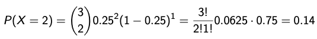
```
]

---
class: top, left
### Wahrscheinlichkeitstheorie und Verteilungen

#### Wahrscheinlichkeitsrechnung als Grundlage der Inferenzstatistik

##### Spezielle diskrete Verteilungen

**Binomialverteilung**

* Binomialverteilte ZV nimmt Werte zwischen 0 und n an

* Binomialverteilung ist symmetrisch für p = 0.5

* Je kleiner/größer p desto rechts/links-schiefer die Verteilung

* Summe mehrerer Bernoulli-Variablen

Erwartungswert und Varianz:

$$E[X]=np$$ 

$$σ^2 =np(1−p)$$

* Für $n = 1$: $B(1, p)$ ist eine Bernoulli-ZV mit Erwartungswert p und Varianz $p(1 − p)$

---
class: top, left
### Wahrscheinlichkeitstheorie und Verteilungen

#### Wahrscheinlichkeitsrechnung als Grundlage der Inferenzstatistik

##### Spezielle diskrete Verteilungen

**Poisson-Verteilung**

* Diese Verteilung beschreibt ZV, die alle natürliche Zahlen und 0 annehmen können

Wahrscheinlichkeitsfunktion:

.center[
```{r eval = TRUE, echo = F, out.width = "550px"}
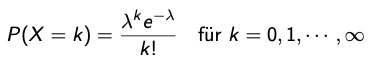
```
]

* λ ist der Parameter der Poisson-Verteilung und kann jede reelle positive Zahl sein

Erwartungswert und Varianz:

$$E[X]=λ$$

$$σ^2=λ$$
---
class: top, left
### Wahrscheinlichkeitstheorie und Verteilungen

#### Wahrscheinlichkeitsrechnung als Grundlage der Inferenzstatistik

##### Spezielle diskrete Verteilungen

**Poisson-Verteilung**

* Poisson-Verteilung ist Grenzverteilung der Binomialverteilung bei $n$ → $∞$ und $p$ → 0 unter der Nebenbedingung, dass $np = λ$ beschränkt bleibt

* Poisson-Verteilung kann als gute Approximation für die Binomialverteilung bei großem n und kleinem p verwendet werden

* Poisson-Verteilung beschreibt seltene Ereignisse

* Anwendung bei binomialverteilter ZV mit unbekanntem oder großem $n$ (leichtere Berechnung) und kleinem $p$

---
class: top, left
### Wahrscheinlichkeitstheorie und Verteilungen

#### Wahrscheinlichkeitsrechnung als Grundlage der Inferenzstatistik

##### Spezielle diskrete Verteilungen

**Beispiel: Poisson-Verteilung**

Die Wahrscheinlichkeit, dass ein Patient die Injektion eines Serums nicht verträgt sei 0.001. Wie groß ist die Wahrscheinlichkeit, dass von 200 Patienten mehr als 1 die Injektion nicht vertragen?

.center[
```{r eval = TRUE, echo = F, out.width = "550px"}
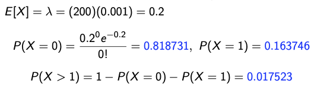
```
]

---
class: top, left
### Wahrscheinlichkeitstheorie und Verteilungen

#### Wahrscheinlichkeitsrechnung als Grundlage der Inferenzstatistik

##### Spezielle stetige Verteilungen

**Normalverteilung (NV)**

* Die NV ist eine stetige Verteilung, die durch 2 Parameter $μ$ und $σ$ charakterisiert ist

* Es sei X eine ZV die $N(μ,σ^2)$ verteilt ist; X kann Werte zwischen $−∞$ und $+∞$ annehmen

Dichtefunktion φ(x):

.center[
```{r eval = TRUE, echo = F, out.width = "350px"}
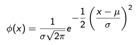
```
]

* Geht x → $±∞$ strebt $φ(x)$ gegen 0

* $φ(x)$ ist symmetrisch um $μ$

---
class: top, left
### Wahrscheinlichkeitstheorie und Verteilungen

#### Wahrscheinlichkeitsrechnung als Grundlage der Inferenzstatistik

##### Spezielle stetige Verteilungen

**Normalverteilung (NV)**

* $σ$ gibt den Abstand zwischen $μ$ und den Wendepunkten der Dichtefunktion an

* Wendepunkte an den Stellen $μ±σ$

* Wenn $σ$ groß ist, ist die Verteilung breit und niedrig, wenn $σ$ klein ist, ist die Verteilung schmal und hoch

* Fläche unter $φ(x)$ zwischen $−∞$ und $+∞$ ist gleich 1

* Die Fläche $μ ± σ$ umfasst ca. 68% aller Fälle

* Die Fläche $μ ± 2σ$ umfasst ca. 95% aller Fälle

* Es existieren unendlich viele NV durch beliebige Auswahl von $μ$ und $σ$


---
class: top, left
### Wahrscheinlichkeitstheorie und Verteilungen

#### Wahrscheinlichkeitsrechnung als Grundlage der Inferenzstatistik

##### Spezielle stetige Verteilungen

**Normalverteilung (NV)**

.center[
```{r echo=FALSE, out.width="350px", out.height="350px"}
x = rnorm(100, mean = 0, sd = 1)
ggplot(data = data.frame(x = c(-6 * sd(x) + mean(x), 6 * sd(x) + mean(x))), aes(x)) +
  stat_function(fun = dnorm, n = 101, args = list(mean = mean(x), sd = sd(x)+2)) + 
  ylab("φ(x)") +
  xlab("") +
  ggtitle("N(1,3)") +
  scale_x_continuous(breaks = c(mean(x) - (sd(x)+2), mean(x), mean(x) + (sd(x)+2)), labels = c("-σ","μ", "+σ")) +
  scale_y_continuous(breaks = NULL) +
  geom_vline(xintercept = mean(x), linetype = "dashed", colour = "red") +
  geom_vline(xintercept = sd(x) + 2, linetype = "dashed", colour = "red") +
    geom_vline(xintercept = mean(x) - (sd(x)+2), linetype = "dashed", colour = "red") +
  theme_classic() +
  theme(text = element_text(size = 25))
```
]


---
class: top, left
### Wahrscheinlichkeitstheorie und Verteilungen

#### Wahrscheinlichkeitsrechnung als Grundlage der Inferenzstatistik

##### Spezielle stetige Verteilungen

**Standardnormalverteilung $N(0,1)$**

* Spezielle NV für $μ = 0$ und $σ = 1$ (Gauß’sche Glockenkurve)

* Verteilung der $N(0,1)$ ist tabelliert

* Fläche zwischen $μ = 0$ und einem beliebigen Wert z ist ablesbar 

* Quantile der NV; 1-Fläche rechts von einem Wert z, und links von −z 

* Ist X $N(μ,σ^2)$ verteilt dann führt die Transformation $\frac{X−μ}{σ}$ auf eine $N(0,1)$ Verteilung

* Vorteil, da Quantile in Tabellen ablesbar (es müssen nicht jedes mal Integrale für Dichtefunktion berechnet werden)

---
class: top, left
### Wahrscheinlichkeitstheorie und Verteilungen

#### Wahrscheinlichkeitsrechnung als Grundlage der Inferenzstatistik

##### Spezielle stetige Verteilungen

**Standardnormalverteilung $N(0,1)$**

.center[
```{r echo=FALSE, out.width="350px", out.height="350px"}
x = rnorm(100, mean = 0, sd = 1)
ggplot(data = data.frame(x = c(-3 * sd(x) + mean(x), 3 * sd(x) + mean(x))), aes(x)) +
  stat_function(fun = dnorm, n = 101, args = list(mean = mean(x), sd = sd(x))) + 
  ylab("φ(x)") +
  xlab("") +
  ggtitle("N(0,1)") +
  scale_x_continuous(breaks = c(mean(x) - (sd(x)), mean(x), mean(x) + (sd(x))), labels = c("-1","0", "1")) +
  scale_y_continuous(breaks = NULL) +
  geom_vline(xintercept = mean(x), linetype = "dashed", colour = "red") +
  geom_vline(xintercept = sd(x) , linetype = "dashed", colour = "red") +
    geom_vline(xintercept = mean(x) - (sd(x)), linetype = "dashed", colour = "red") +
  theme_classic() +
  theme(text = element_text(size = 25))
```
]

---
class: top, left
### Take-aways

.full-width[.content-box-gray[
* **Inferenzstatistik** ist ein wahrscheinlichkeitsbasierter Schluss von Zufallsstichprobe auf Population

* Variablen in der Population sind nicht vollständig beobachtbar und daher **Zufallsvariablen** (diskret vs. stetig)

* **Wahrscheinlichkeitsfunktion** definiert welche Werte wir beim zufälligen Ziehen mit welcher Wahrscheinlichkeit erwarten

* Der **Erwartungswert** ist das Zentrum der Verteilung und der wahrscheinlichste Wert 

* Unter der **Gleichverteilung** ist jedes Ereignis gleich wahrscheinlich

* **Binomialverteilung** lässt uns Wahrscheinlichkeit für ein diskretes Ereignis mit 2 Ausgängen berechnen

* **Poisson Verteilung** ist die Grenzfunktion der Bionmialverteilung für besonders seltene Ereignisse

* **Normalverteilung** ist stetige Verteilung, die extremen Ereignissen geringere und durchschnittlichen Ereignissen höhere Wahrscheinlichkeit zuweist 
]
]

