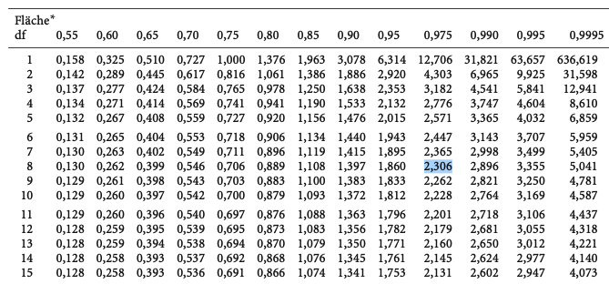
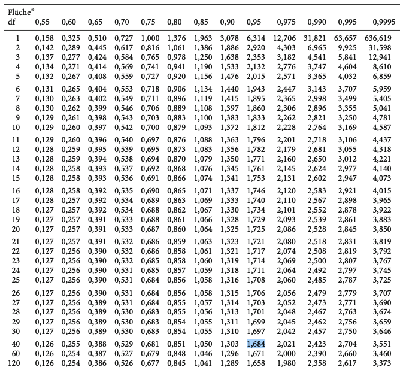
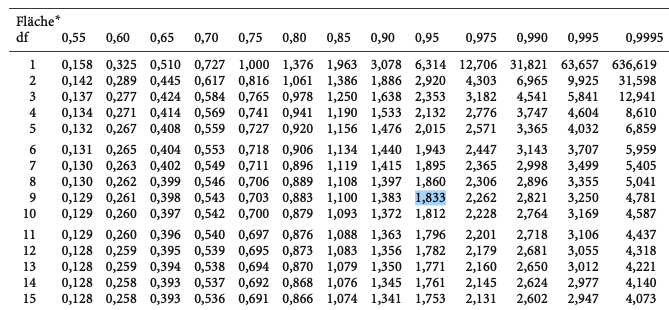
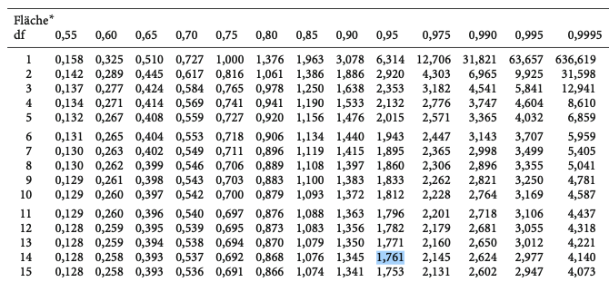

```{r setup, include=FALSE}
options(htmltools.dir.version = FALSE)

setwd("/Users/stephangoerigk/Desktop/Universität/CFH/Lehre/Bachelor/Quantitative Methoden I/VO_Statistik I/Statistik_I_Folien/")

library(tidyverse)
library(kableExtra)
library(ggplot2)
library(plotly)
library(htmlwidgets)
library(MASS)
library(ggpubr)
library(xaringanthemer)
library(xaringanExtra)
library(gghighlight)

style_duo_accent(
  primary_color = "#621C37",
  secondary_color = "#EE0071",
  background_image = "blank.png"
)

xaringanExtra::use_xaringan_extra(c("tile_view"))

use_scribble(
  pen_color = "#EE0071",
  pen_size = 4
)

knitr::opts_chunk$set(
  fig.retina = TRUE,
  warning = FALSE,
  message = FALSE
)
```

name: Title slide
class: middle, left
<br><br><br><br><br><br><br>
# Statistik I

### Einheit 9: $t$-Test (Übungsaufgaben Schritt-für-Schritt)
##### 28.06.2023 | Prof. Dr. phil. Stephan Goerigk

---
class: top, left
### Wiederholung: $t$-Test händisch rechnen

**Anleitung - Schritt für Schritt:**

<small>

1. Hypothesenpaar aus $H_{0}$ und $H_{1}$ aufstellen
  * VORSICHT: gerichtet oder ungerichtet $\rightarrow$ Unterschied bei Signifikanzgrenze

2. Mittelwerte und Streuungen berechnen (es sei denn bereits angegeben). 
  * VORSICHT: Es kann in der Aufgabenstellung Varianz ODER Standardabweichung gegeben sein
  * VORSICHT: Beim abhängigen t-Test Mittelwert und Streuung der Differenzen (Post-Prä) berechnen
  
3. Stichprobengrößen berücksichtigen
  * VORSICHT: Es können gleich große $(n_1=n_2)$ oder unterschiedliche große Gruppen $(n_1 \neq n_2)$ vorliegen

4. t-Wert $(t_{emp})$ unter der Nullhypothese bestimmen

5. kritischen t-Wert $(t_{krit})$ aus Tabelle ablesen
  * VORSICHT: gerichtet/einseitig $\rightarrow$ $1-\alpha =.95$; ungerichtet/zweiseitig $\rightarrow$ $\frac{1-\alpha}{2}=.975$

6. Vergleich von $t_{emp}$ mit $t_{krit}$. Wenn $t_{emp} > t_{krit}$ $\rightarrow$ Test signifikant $\rightarrow$ $H_{0}$ verwerfen

</small>

---
class: top, left
### $t$-Test

#### Übungsaufgabe 1: Remuneration

* Eine Psychologiestudentin möchte Versuchspersonen nach Teilnahme an ihrem Experiment mit einem kleinen Geldbetrag vergüten.

* Sie möchte wissen, ob in Abhängigkeit der Höhe des Betrags Unterschiede in der Zufriedenheit der Teilnehmer:innen bestehen.

* Höhere Werte zeigen höhere Zufriedenheit an.

* Ihre Ergebnisse stehen in der nachfolgenden Tabelle:

.pull-left[
```{r echo = F}
df = data.frame(G1 = c(4,2,3,5,4),
                G2 = c(6,4,7,8,8))

names(df) = c("Gruppe 1: erhält 10€", "Gruppe 2: erhält 50€")

df %>%
  kbl() %>%
  kable_styling(font_size = 18) %>%
  kable_classic(full_width = F)
```
]

.pull-right[
Es ergeben sich folgende Kennwerte:
* $\bar{x}_1 = 3.6$
* $\bar{x}_2 = 6.6$
* $\hat{\sigma}_1 = 1.14$
* $\hat{\sigma}_2 = 1.67$
]

---
class: top, left
### $t$-Test

#### Übungsaufgabe 1: Remuneration

.pull-left[
```{r echo = F}
df = data.frame(G1 = c(4,2,3,5,4),
                G2 = c(6,4,7,8,8))

names(df) = c("Gruppe 1: erhält 10€", "Gruppe 2: erhält 50€")

df %>%
  kbl() %>%
  kable_styling(font_size = 18) %>%
  kable_classic(full_width = F)
```
]

.pull-right[
Es ergeben sich folgende Kennwerte:
* $\bar{x}_1 = 3.6$
* $\bar{x}_2 = 6.6$
* $\hat{\sigma}_1 = 1.14$
* $\hat{\sigma}_2 = 1.67$
]

<br>

**Aufgaben:**

a) Stellen Sie das Hypothesenpaar aus $H_{0}$ und $H_{1}$ auf.

b) Prüfen Sie, ob es einen statistischen Unterschied zwischen den Gruppen gibt $(\alpha=.05)$. Varianzhomogenität und Normalverteilung in den Gruppen kann angenommen werden.

---
class: top, left
### $t$-Test

#### Übungsaufgabe 1: Remuneration

a) Stellen Sie $H_{0}$ und $H_{1}$ auf.

* $H_{0}$: $μ_2 - μ_1 =0$
* $H_{1}$: $μ_2 - μ_1 \neq0$

**Interpretation:**

* $H_{0}$:
  * Die $H_{0}$ besagt, dass kein signifikanter Unterschied zwischen den Gruppen besteht.
  * Laut der $H_{0}$ macht es keinen Unterschied, wie viel Geld die Teilnehmer:innen bekommen.
* $H_{1}$:
  * Die $H_{1}$ besagt, dass ein signifikanter Unterschied zwischen den Gruppen besteht.
  * Laut der $H_{1}$ hat der Unterschied im gezahlten Geldbetrag einen Effekt auf die Zufriedenheit der Teilnehmer:innen.

---
class: top, left
### $t$-Test

#### Übungsaufgabe 1: Remuneration
<small>

b) Prüfen Sie, ob es einen statistischen Unterschied zwischen den Gruppen gibt $(\alpha=.05)$. Varianzhomogenität und Normalverteilung in den Gruppen kann angenommen werden.

t-Test für unabhängige Stichproben:

$$t = \frac{\bar{x}_{1}- \bar{x}_{2}}{\sqrt{\frac{(n_{1} - 1) \cdot \hat{\sigma^2_{1}}+ (n_{2} - 1) \cdot \hat{\sigma^2_{2}}}{(n_{1} - 1) + (n_{2} - 1)} (\frac{1}{n_{1}}+\frac{1}{n_{2}})}}; df=n_{1}+n_{2} - 2$$

$$t = \frac{6.6 - 3.6}{\sqrt{\frac{(5 - 1) \cdot 1.14^2+ (5 - 1) \cdot 1.67^2}{(5 - 1) + (5 - 1)} (\frac{1}{5}+\frac{1}{5})}}; df=5+5 - 2$$
$$t = \frac{3}{\sqrt{0.8177}} = \frac{3}{0.9} = 3.33; df=8$$
</small>

---
class: top, left
### $t$-Test

#### Übungsaufgabe 1: Remuneration

Kritischen t-Wert $(t_{krit})$ für $a=.05$ nachschlagen:

.center[
```{r eval = TRUE, echo = F, out.width = "750px"}

```
]

---
class: top, left
### $t$-Test

#### Übungsaufgabe 1: Remuneration
<small>

b) Prüfen Sie, ob es einen statistischen Unterschied zwischen den Gruppen gibt $(\alpha=.05)$. Varianzhomogenität und Normalverteilung in den Gruppen kann angenommen werden.

t-Test für unabhängige Stichproben:

$$t = \frac{\bar{x}_{1}- \bar{x}_{2}}{\sqrt{\frac{(n_{1} - 1) \cdot \hat{\sigma^2_{1}}+ (n_{2} - 1) \cdot \hat{\sigma^2_{2}}}{(n_{1} - 1) + (n_{2} - 1)} (\frac{1}{n_{1}}+\frac{1}{n_{2}})}}; df=n_{1}+n_{2} - 2$$

$$t = \frac{6.6 - 3.6}{\sqrt{\frac{(5 - 1) \cdot 1.14^2+ (5 - 1) \cdot 1.67^2}{(5 - 1) + (5 - 1)} (\frac{1}{5}+\frac{1}{5})}}; df=5+5 - 2$$
$$t = \frac{3}{\sqrt{0.8177}} = \frac{3}{0.9} = 3.33; df=8$$
* $t_{krit(df=8)}=2.306$ $\rightarrow$ Spalte für 0.975 in der t-Tabelle, da ungerichtete Hypothese
* Der empirische t-Wert ist größer als der kritische t-Wert, die Mittelwerte unterscheiden sich signifikant voneinander.
* Die $H_{0}$ kann verworfen werden. Es macht einen Unterschied, wie viel Geld die Proband:innen bekommen.

</small>

---
class: top, left
### $t$-Test

#### Übungsaufgabe 2: Emotionsinduktion

* Ein Forscher möchte den Effekt von Gruselpodcasts auf die Angst von Versuchspersonen untersuchen.

* Er lässt die Personen jeweils entweder einen Gruselpodcast (Gruppe 1) oder einen Wissenspodcast (Gruppe 2) anhören.

* Seine Annahme lautet, dass die Personen ihre Angst auf einer Skala von 1-10 Punkten im Durchschnitt höher berichten, wenn sie zuvor einen Gruselpodcast gehört haben.

Ergebnisse aus der Stichprobe:

* $\bar{x}_1 = 6.8$
* $\bar{x}_2 = 5.9$
* $\hat{\sigma}^2_1 = 3.2$
* $\hat{\sigma}^2_2 = 3.8$
* $n_1 = 25$
* $n_2 = 28$

---
class: top, left
### $t$-Test

#### Übungsaufgabe 2: Emotionsinduktion

Ergebnisse aus der Stichprobe:

* $\bar{x}_1 = 6.8$
* $\bar{x}_2 = 5.9$
* $\hat{\sigma}^2_1 = 3.2$
* $\hat{\sigma}^2_2 = 3.8$
* $n_1 = 25$
* $n_2 = 28$

**Aufgaben:**

a) Stellen Sie $H_{0}$ und $H_{1}$ auf.

b)  Prüfen Sie, ob sich die Annahme des Forschers statistisch signifikant nachweisen lässt $(\alpha=.05)$. Varianzhomogenität und Normalverteilung in den Gruppen kann angenommen werden.

---
class: top, left
### $t$-Test

#### Übungsaufgabe 2: Emotionsinduktion

a) Stellen Sie $H_{0}$ und $H_{1}$ auf.

* $H_{0}$: $μ_1 - μ_2 \leq 0$
* $H_{1}$: $μ_1 - μ_2 > 0$

**Interpretation:**

* $H_{0}$:
  * Die $H_{0}$ besagt, dass kein signifikanter Unterschied zwischen den Gruppen besteht, bzw. dieser nicht in die von der $H_{1}$ postulierte Richtung geht.
  * Laut der $H_{0}$ führt das Hören gruseliger Podcasts nicht zu höherer Angst.
* $H_{1}$:
  * Die $H_{1}$ besagt, dass das Hören gruseliger Podcasts zu höherer Angst führt.

---
class: top, left
### $t$-Test

#### Übungsaufgabe 2: Emotionsinduktion

<small>

b)  Prüfen Sie, ob sich die Annahme des Forschers statistisch signifikant nachweisen lässt $(\alpha=.05)$. Varianzhomogenität und Normalverteilung in den Gruppen kann angenommen werden.

t-Test für unabhängige Stichproben:

$$t = \frac{\bar{x}_{1}- \bar{x}_{2}}{\sqrt{\frac{(n_{1} - 1) \cdot \hat{\sigma^2_{1}}+ (n_{2} - 1) \cdot \hat{\sigma^2_{2}}}{(n_{1} - 1) + (n_{2} - 1)} (\frac{1}{n_{1}}+\frac{1}{n_{2}})}}; df=n_{1}+n_{2} - 2$$

$$t = \frac{6.8- 5.9}{\sqrt{\frac{(25 - 1) \cdot 3.2+ (28 - 1) \cdot 3.8}{(25 - 1) + (28 - 1)} (\frac{1}{25}+\frac{1}{28})}}; df=25+28 - 2$$

$$t = \frac{0.9}{0.52}= 1.73; df=51$$
</small>

---
class: top, left
### $t$-Test

#### Übungsaufgabe 2: Emotionsinduktion

Kritischen t-Wert $(t_{krit})$ für $a=.05$ nachschlagen:

.center[
```{r eval = TRUE, echo = F, out.width = "450px"}

```
]

---
class: top, left
### $t$-Test

#### Übungsaufgabe 2: Emotionsinduktion

<small>

b)  Prüfen Sie, ob sich die Annahme des Forschers statistisch signifikant nachweisen lässt $(\alpha=.05)$. Varianzhomogenität und Normalverteilung in den Gruppen kann angenommen werden.

t-Test für unabhängige Stichproben:

$$t = \frac{\bar{x}_{1}- \bar{x}_{2}}{\sqrt{\frac{(n_{1} - 1) \cdot \hat{\sigma^2_{1}}+ (n_{2} - 1) \cdot \hat{\sigma^2_{2}}}{(n_{1} - 1) + (n_{2} - 1)} (\frac{1}{n_{1}}+\frac{1}{n_{2}})}}; df=n_{1}+n_{2} - 2$$

$$t = \frac{6.8- 5.9}{\sqrt{\frac{(25 - 1) \cdot 3.2+ (28 - 1) \cdot 3.8}{(25 - 1) + (28 - 1)} (\frac{1}{25}+\frac{1}{28})}}; df=25+28 - 2$$

$$t = \frac{0.9}{0.52}= 1.73; df=51$$
* $t_{krit(df=40)}=1.684$ $\rightarrow$ Spalte für 0.95 in der t-Tabelle, da gerichtete Hypothese
* Der empirische t-Wert ist größer als der kritische t-Wert, die Mittelwerte unterscheiden sich signifikant voneinander.
* Die $H_{0}$ kann verworfen werden. Gruselpodcasts machen den Teilnehmer:innen signifikant mehr Angst.

</small>

---
class: top, left
### $t$-Test

#### Übungsaufgabe 3: Therapieevaluation

.pull-left[

* Eine Therapeutin hat eine neue Unterform der kognitiven Verhaltenstherapie entwickelt, bei der besonders auf Patientenfeedback geachtet wird.

* Sie möchte prüfen, ob diese neue Therapievariante die Lebensqualität von Patient:innen signifikant erhöhen kann.

* Sie misst zunächst die Lebensqualität (Prä-Messung), führt dann die Therapie durch und misst dann erneut die Lebensqualität (Post-Messung).
]

.pull-right[

```{r echo = F}
df = data.frame(Prä = c(4,6,3,7,2,8,3,5,6,4),
                Post = c(6,7,8,7,4,7,6,6,8,5))
df %>%
  kbl() %>%
  kable_styling(font_size = 18) %>%
  kable_classic(full_width = T)
```
]

---
class: top, left
### $t$-Test

#### Übungsaufgabe 3: Therapieevaluation

.pull-left[

**Aufgaben:**

a) Stellen Sie $H_{0}$ und $H_{1}$ auf.

b) Berechnen Sie den Kennwert des Tests und seine Streung.

c) Prüfen Sie, ob sich die Therapie signifikant positiv auf die Lebensqualität auswirkt $(\alpha=.05)$. Normalverteilung der Differenzwerte kann angenommen werden.
]

.pull-right[

```{r echo = F}
df = data.frame(Prä = c(4,6,3,7,2,8,3,5,6,4),
                Post = c(6,7,8,7,4,7,6,6,8,5))
df %>%
  kbl() %>%
  kable_styling(font_size = 18) %>%
  kable_classic(full_width = T)
```
]

---
class: top, left
### $t$-Test

#### Übungsaufgabe 3: Therapieevaluation

a) Stellen Sie $H_{0}$ und $H_{1}$ auf.

* $H_{0}$: $μ_{d} \leq 0$
* $H_{1}$: $μ_{d} > 0$

**Interpretation:**

* $H_{0}$:
  * Die $H_{0}$ besagt, dass kein signifikanter Unterschied zwischen den Messwerten  zu Prä und Post besteht, bzw. dieser nicht in die von der $H_{1}$ postulierte Richtung geht.
  * Laut der $H_{0}$ führt die Therapie nicht zu einer erhöhten Lebensqualität.
* $H_{1}$:
  * Die $H_{1}$ besagt, dass die Therapie die Lebensqualität von Zeitpunkt Prä nach Post erhöhen kann.
  
---
class: top, left
### $t$-Test

#### Übungsaufgabe 3: Therapieevaluation

.pull-left[

b) Kennwert und Streuung des Kennwerts:

$$\bar{x}_d=\frac{\sum\limits _{i=1}^{n}d_{i}}{n} = 1.6$$

$$\hat{\sigma}_d = \sqrt{\frac{\sum\limits _{i=1}^{N}(d_{i}-\bar{x}_d)^2}{N-1}}=1.65$$
]

.pull-right[
```{r echo = F}
df = data.frame(Prä = c(4,6,3,7,2,8,3,5,6,4),
                Post = c(6,7,8,7,4,7,6,6,8,5))
df$d = df$Post - df$Prä

names(df) = c("Prä", "Post", "d (Post-Prä)")
  
df %>%
  kbl() %>%
  kable_styling(font_size = 18) %>%
  kable_classic(full_width = T)
```
]

---
class: top, left
### $t$-Test

#### Übungsaufgabe 3: Therapieevaluation

<small>

c) Prüfen Sie, ob sich die Therapie signifikant positiv auf die Lebensqualität auswirkt.

* $\bar{x}_d = 1.6$
* $\hat{\sigma}_d = 1.65$
* $df = n-1=9$

Berechnung des Standardfehlers der Differenzen:

$$\hat{\sigma}_{\bar{x}_d} = \frac{\hat{\sigma}_d}{\sqrt{N}}=\frac{1.65}{\sqrt{10}}=0.52$$
t-Test für abhängige Stichproben:

$$t_{abhängig}=\frac{\bar{x}_d}{\hat{\sigma}_{\bar{x}_d}}= \frac{1.6}{0.52}=3.07$$

</small>

---
class: top, left
### $t$-Test

#### Übungsaufgabe 3: Therapieevaluation

Kritischen t-Wert $(t_{krit})$ für $a=.05$ nachschlagen:

.center[
```{r eval = TRUE, echo = F, out.width = "750px"}

```
]

---
class: top, left
### $t$-Test

#### Übungsaufgabe 3: Therapieevaluation

<small>

c) Prüfen Sie, ob sich die Therapie signifikant positiv auf die Lebensqualität auswirkt.

* $\bar{x}_d = 1.6$
* $\hat{\sigma}_d = 1.65$
* $df = n-1=9$

Berechnung des Standardfehlers der Differenzen:

$$\hat{\sigma}_{\bar{x}_d} = \frac{\hat{\sigma}_d}{\sqrt{N}}=\frac{1.65}{\sqrt{10}}=0.52$$
t-Test für abhängige Stichproben:

$$t_{abhängig}=\frac{\bar{x}_d}{\hat{\sigma}_{\bar{x}_d}}= \frac{1.6}{0.52}=3.07$$
* $t_{krit(df=9)}=1.833$ $\rightarrow$ Spalte für 0.95 in der t-Tabelle, da gerichtete Hypothese
* Der empirische t-Wert ist größer als der kritische t-Wert, die Mittelwerte unterscheiden sich signifikant voneinander.
* Die $H_{0}$ kann verworfen werden. Die neue Thearpievariante führt zu signifikanter Verbesserung in der Lebensqualität.

</small>

---
class: top, left
### $t$-Test

#### Übungsaufgabe 4: Zeit bis Relapse

* Eine neue tiefenpsychologische Therapieform zur Behandlung von chronischer Depression soll angeblich ein besonders stabiles Therapieansprechen bewirken

* Stabil heißt in diesem Zusammenhang, dass Patient:innen die einmal remittieren auch gesund bleiben. Ansonsten spricht man von einem Rückfall (Relapse)

* Ein Forscherteam behauptet, dass Patienten nach Therapieende im Schnitt länger als 40 Monate symptomfrei bleiben.

* In einer Stichprobe von 15 Patient:innen zeigten sich folgende Ergebnisse:

Ergebnisse:

* $\bar{x}=44.9$
* $s=8.9$
* $n=15$

---
class: top, left
### $t$-Test

#### Übungsaufgabe 4: Zeit bis Relapse

* $\bar{x}=44.9$
* $s=8.9$
* $n=15$

**Aufgaben**

a) Stellen Sie $H_{0}$ und $H_{1}$ auf.

b) Prüfen Sie, ob die Zeit bis zum Relapse den Referenzwert von 40 Monaten signifikant überschreitet $(\alpha=.05)$.

---
class: top, left
### $t$-Test

#### Übungsaufgabe 4: Zeit bis Relapse

a) Stellen Sie $H_{0}$ und $H_{1}$ auf.

* $H_{0}$: $μ \leq μ_0$
* $H_{1}$: $μ > μ_0$

**Interpretation:**

* $H_{0}$:
  * Die $H_{0}$ besagt, dass die Zeit bis zum Relapse nicht höher als der Referenzwert ist.
  * Laut der $H_{0}$ führt die Therapie nicht zu einem Therapieansprechen, dass länger als 40 Monate stabil ist.
* $H_{1}$:
  * Die $H_{1}$ besagt, dass die Therapie zu stabilen Ergebnissen, mit Zeiten bis Relapse von durchschnittlich länger als 40 Monate führt.

---
class: top, left
### $t$-Test

#### Übungsaufgabe 4: Zeit bis Relapse

<small>

b) Prüfen Sie, ob die Zeit bis zum Relapse den Referenzwert von 40 Monaten signifikant überschreitet $(\alpha=.05)$.

* $\bar{x}=44.9$
* $s=8.9$
* $n=15$

Ein-Stichproben t-Test:

$$t = \frac{\bar{x}-μ}{\frac{\hat{\sigma}}{\sqrt{n}}}; df = n-1$$

$$t = \frac{44.9-40}{\frac{8.9}{\sqrt{15}}}; df = 15-1$$

$$t = \frac{4.9}{2.298}=2.13; df = 14$$
</small>

---
class: top, left
### $t$-Test

#### Übungsaufgabe 4: Zeit bis Relapse

Kritischen t-Wert $(t_{krit})$ für $a=.05$ nachschlagen:

.center[
```{r eval = TRUE, echo = F, out.width = "750px"}

```
]

---
class: top, left
### $t$-Test

#### Übungsaufgabe 4: Zeit bis Relapse

<small>

b) Prüfen Sie, ob die Zeit bis zum Relapse den Referenzwert von 40 Monaten signifikant überschreitet $(\alpha=.05)$.

* $\bar{x}=44.9$
* $s=8.9$
* $n=15$

Ein-Stichproben t-Test:

$$t = \frac{\bar{x}-μ}{\frac{\hat{\sigma}}{\sqrt{n}}}; df = n-1$$

$$t = \frac{44.9-40}{\frac{8.9}{\sqrt{40}}}; df = 15-1$$

$$t = \frac{4.9}{2.298}=2.13; df = 14$$
* $t_{krit(df=14)}=1.761$ $\rightarrow$ Spalte für 0.95 in der t-Tabelle, da gerichtete Hypothese
* Der empirische t-Wert ist größer als der kritische t-Wert, die Mittelwerte unterscheiden sich signifikant voneinander.
* Die $H_{0}$ kann verworfen werden. Die durchschnittliche Zeit bis zu einem Rückfall ist signifikant länger als 40 Tage.

</small>


---
class: top, left
### Take-aways

.full-width[.content-box-gray[
* t-Test ist ein Auswertungsverfahren für den **Vergleich von Mittelwerten**

* Vergleich von Mittelwerten 2er Gruppen erfolgt mittels **unabhängigem t-Test**, von Mittelwerten 2er Zeitpunkte mit **abhängigem t-Test** und Vergleich von Mittelwert mit vorgegebenem Referenzwert mit **Ein-Stichproben t-Test**

* **Voraussetzungen** für unabhängige t-Test umfassen unabhängige Daten, Intervallskalenniveau, Normalverteilung und Varianzhomogenität

* Vorgehen: Berechnung von $t_{emp}$ und Vergleich mit $t_{krit}$, welcher aus t-Tabelle abgelesen wird

* Vorsicht: t-Test kann zu **Fehlentscheidungen** führen (s.h. $\alpha$-Fehler und $\beta$-Fehler)

* Prüfung, ob Effekt (Mittelwertunterschiede/Mittelwertsdifferenzen), der in Stichprobe gemessen wurde, auf Population **generalisierbar** sind.
]
]


